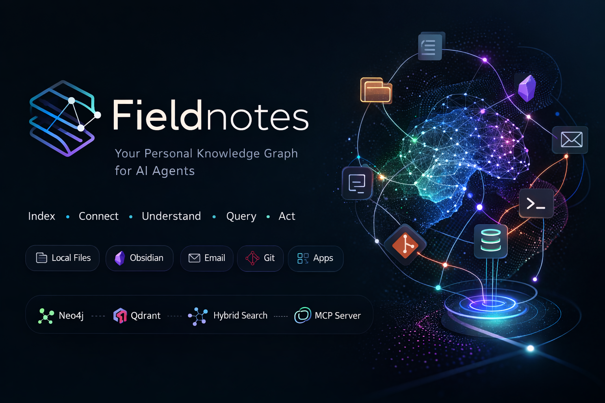

# Fieldnotes

Fieldnotes is a personal knowledge graph that continuously indexes your digital life — local files, Obsidian vaults, email threads, git repositories, and installed applications — and exposes that knowledge as structured context for LLM agents. It combines a property graph (Neo4j) for relationship traversal with a vector store (Qdrant) for semantic retrieval, connected by a hybrid query layer and served over the Model Context Protocol (MCP) so any compatible AI assistant can query everything you know.

## Table of Contents

- [How It Works](#how-it-works)
- [Requirements](#requirements)
- [Installation](#installation)
- [Quick Start](#quick-start)
- [Configuration](#configuration)
- [Data Sources](#data-sources)
- [CLI Reference](#cli-reference)
- [MCP Server](#mcp-server)
- [Pipeline Architecture](#pipeline-architecture)
- [Observability](#observability)
- [Local Development](#local-development)
- [Project Structure](#project-structure)

## How It Works

Fieldnotes watches your configured sources for changes in real time. When a file is saved, an email arrives, or a commit is pushed, the pipeline picks it up and runs it through a sequence of stages:

```
Source Event (file / email / commit / app)
        │
        ▼
   ┌─────────┐
   │  Parser  │  → extracts text, metadata, and graph hints
   └────┬─────┘
        │
        ▼
   ┌──────────┐
   │  Chunker  │  → splits text into ~512-token windows (64-token overlap)
   └────┬──────┘
        │
   ┌────┴─────────────────────┐
   │                          │
   ▼                          ▼
┌──────────┐           ┌───────────┐
│ Embedder │           │ Extractor │  → LLM-based entity and triple extraction
└────┬─────┘           └─────┬─────┘
     │                       │
     │                  ┌────▼─────┐
     │                  │ Resolver │  → deduplicates entities (fuzzy matching)
     │                  └────┬─────┘
     │                       │
     └───────┬───────────────┘
             ▼
        ┌─────────┐
        │  Writer  │  → persists to Neo4j (graph) + Qdrant (vectors)
        └─────────┘
```

Images follow a parallel path through a vision model that extracts descriptions, OCR text, and entities before rejoining the main pipeline at the embedding stage.

Topic discovery runs on a schedule (default: weekly) using UMAP dimensionality reduction and HDBSCAN clustering over the full vector corpus, with an LLM naming each discovered cluster.

## Requirements

- Python 3.11+
- Docker and Docker Compose (for Neo4j, Qdrant, and observability stack)
- [Ollama](https://ollama.ai) (default local LLM provider) — or API keys for OpenAI / Anthropic

## Installation

```bash
# With pip
pip install fieldnotes

# With uv
uv tool install fieldnotes

# With pipx
pipx install fieldnotes

# From source
git clone https://github.com/mmlac/fieldnotes.git
cd fieldnotes
pip install -e ".[dev]"
```

## Quick Start

```bash
# 1. Bootstrap configuration
fieldnotes init
# Creates ~/.fieldnotes/config.toml with sensible defaults

# 2. Set the Neo4j password and start infrastructure
export NEO4J_PASSWORD=changeme
docker compose up -d

# 3. Pull the default embedding model
ollama pull nomic-embed-text

# 4. Start the daemon (pipeline + MCP server)
fieldnotes serve --daemon

# 5. Search your knowledge graph
fieldnotes search "what do I know about kubernetes"

# 6. Ask a question (RAG + LLM synthesis)
fieldnotes ask "summarize my recent project decisions"
```

## Configuration

Fieldnotes reads `~/.fieldnotes/config.toml` (override with `fieldnotes -c /path/to/config.toml`). Run `fieldnotes init` to generate the default config, or copy `config.toml.example` from this repository.

### Core

```toml
[core]
data_dir = "~/.fieldnotes/data"   # persistent storage for Docker volumes
log_level = "info"                # debug | info | warning | error
```

### Databases

```toml
[neo4j]
uri = "bolt://localhost:7687"
user = "neo4j"                    # or NEO4J_USER env var
password = ""                     # or NEO4J_PASSWORD env var (required)

[qdrant]
host = "localhost"
port = 6333
collection = "fieldnotes"
vector_size = 768                 # must match your embedding model
```

### Model Providers

Fieldnotes uses a three-layer model config: **providers** register API connections, **models** name specific model+provider pairs, and **roles** bind pipeline stages to models.

```toml
# Layer 1: Provider connections
[modelproviders.ollama]
type = "ollama"
base_url = "http://localhost:11434"

[modelproviders.openai]
type = "openai"
api_key = ""                      # or OPENAI_API_KEY env var

[modelproviders.anthropic]
type = "anthropic"
api_key = ""                      # or ANTHROPIC_API_KEY env var

# Layer 2: Named models
[models.local_embed]
provider = "ollama"
model = "nomic-embed-text"

[models.local_chat]
provider = "ollama"
model = "llama2"

# Layer 3: Role bindings (which model does what)
[models.roles]
embed = "local_embed"             # vector embeddings
extract = "local_chat"            # entity/triple extraction
extract_fallback = "local_chat"   # retry on malformed JSON
query = "local_chat"              # NL → Cypher translation
vision = "local_chat"             # image analysis
clustering = "local_chat"         # topic naming
completion = "local_chat"         # ask tool synthesis
```

### Sources

```toml
[sources.files]
watch_paths = ["~/Documents"]
include_extensions = [".md", ".txt"]    # optional filter
exclude_patterns = ["node_modules/"]
recursive = true
max_file_size = 104857600               # 100 MB

[sources.obsidian]
vault_path = "~/obsidian-vault"

[sources.gmail]
poll_interval_seconds = 300
max_initial_threads = 500
label_filter = "INBOX"
client_secrets_path = "~/.fieldnotes/credentials.json"

[sources.repositories]
repo_roots = ["~/projects"]
include_patterns = ["README*", "CHANGELOG*", "CONTRIBUTING*", "docs/**/*.md", "*.toml", "ADR/**/*.md"]
exclude_patterns = ["node_modules/", ".git/", "vendor/", "target/", "__pycache__/"]
poll_interval_seconds = 300
max_file_size = 104857600
```

macOS apps and Homebrew sources require no configuration — they auto-discover installed software.

### Features

```toml
[clustering]
enabled = true
cron = "0 3 * * 0"               # Sunday 3 AM
min_corpus_size = 100            # skip if fewer vectors

[vision]
enabled = true
concurrency = 2
max_file_size_mb = 20
skip_patterns = ["icon", "avatar", "favicon", "badge"]

[mcp]
enabled = true
port = 3456
```

### Environment Variables

| Variable | Purpose | Default |
|---|---|---|
| `NEO4J_USER` | Neo4j username | `neo4j` |
| `NEO4J_PASSWORD` | Neo4j password | *required* |
| `OPENAI_API_KEY` | OpenAI API key | — |
| `ANTHROPIC_API_KEY` | Anthropic API key | — |
| `FIELDNOTES_DATA` | Docker volume root | `~/.fieldnotes/data` |
| `GRAFANA_PASSWORD` | Grafana admin password | `fieldnotes` |

## Data Sources

| Source | Sync Mode | What It Indexes |
|---|---|---|
| **Files** | Real-time (watchdog) | Markdown, text, and other configured file types |
| **Obsidian** | Real-time (watchdog) | Notes with frontmatter, wikilinks, and #tags |
| **Gmail** | Polling (configurable interval) | Email threads — subjects, bodies, metadata |
| **Git Repositories** | Polling (configurable interval) | READMEs, changelogs, docs, commit messages |
| **macOS Apps** | On-demand | Installed application bundles (Info.plist) |
| **Homebrew** | On-demand | Installed formulae and casks with descriptions |

Each source emits `IngestEvent` dicts into the pipeline queue. Modified files trigger a delete-before-rewrite cycle that cleans stale graph data (edges, chunks, orphan entities) in a single Neo4j transaction before writing the updated version.

## CLI Reference

```
fieldnotes [-c CONFIG] [-v] <command>
```

### Commands

**`init`** — Bootstrap `~/.fieldnotes/config.toml` and data directories.

**`search <query> [-k N]`** — Hybrid search combining graph traversal and vector similarity. Returns ranked results with source metadata.

**`ask [question]`** — Interactive Q&A against the knowledge graph. Retrieves context via hybrid search and synthesizes an answer with an LLM.
  - With no argument, starts a REPL with conversation history, streaming output, and question reformulation for follow-ups.
  - `--resume [id]` — resume a previous conversation (omit id for most recent).
  - `--history` — list past conversations.
  - `--no-stream` — disable streaming output.
  - `--json` — structured JSON output.

**`topics list`** — List all discovered topics with document counts.

**`topics show <name>`** — Topic details: description, linked documents, related entities.

**`topics gaps`** — Topics discovered by clustering that aren't in your manual taxonomy.

**`serve --daemon`** — Run the ingest pipeline and MCP server together.

**`serve --mcp`** — Run only the MCP server (stdio transport, for Claude Desktop).

**`service install|uninstall|status|start|stop`** — Manage fieldnotes as a system service (launchd on macOS, systemd on Linux).

**`setup-claude`** — Configure Claude Desktop to use the fieldnotes MCP server.

## MCP Server

Fieldnotes exposes tools over the [Model Context Protocol](https://modelcontextprotocol.io) via stdio transport, making it available to Claude Desktop, Claude Code, and other MCP-compatible clients.

### Tools

| Tool | Description |
|---|---|
| `search(query, top_k?, source_type?)` | Hybrid graph + vector search with optional source filtering |
| `ask(question, source_type?)` | RAG + LLM synthesis — retrieves context and generates an answer |
| `list_topics(source?)` | List topics (`all`, `cluster`, or `user`) with document counts |
| `show_topic(name)` | Topic details: description, documents, related entities and topics |
| `topic_gaps()` | Cluster-discovered topics missing from your manual taxonomy |
| `ingest_status()` | Index health: source counts, last sync times, circuit breaker states |

### Claude Desktop Integration

```bash
fieldnotes setup-claude
```

This registers fieldnotes as an MCP server in Claude Desktop's configuration. After restarting Claude Desktop, it can query your knowledge graph directly during conversations.

## Pipeline Architecture

### Databases

**Neo4j** (property graph) stores the knowledge graph:
- **Nodes**: Document, Entity (Person, Technology, Project, Organization, Concept), Topic
- **Edges**: MENTIONS, APPEARS_IN, BELONGS_TO, DEPICTS, RELATED_TO_TOPIC, and extracted relationship triples
- **Queries**: Natural language translated to Cypher via LangChain (read-only execution)

**Qdrant** (vector store) enables semantic search:
- 768-dimensional embeddings (default: `nomic-embed-text` via Ollama)
- Payload includes text, source type, source ID, date, and chunk index
- Top-k cosine similarity with optional source filtering

### Pipeline Stages

1. **Parser** — Source-specific adapter extracts text, metadata, and graph hints (pre-known entities/edges) from raw content.
2. **Chunker** — Sentence-aware splitter produces ~512-token chunks with 64-token overlap. Short chunks are merged to avoid fragmentation.
3. **Embedder** — Generates 768-dim vectors via the `embed` role model. Batches 64 texts per call.
4. **Extractor** — LLM extracts named entities (typed: Person, Technology, etc.) and relationship triples from each chunk. Falls back to `extract_fallback` role on JSON parse errors.
5. **Resolver** — Deduplicates entities across chunks using fuzzy string matching (rapidfuzz). Resolves references to canonical names.
6. **Writer** — Persists everything in a single Neo4j transaction per document: upsert source node, write entities, write chunks, write graph hint edges, clean orphans. Upserts chunk vectors to Qdrant.

### Vision Pipeline

Images are processed asynchronously through a vision model that extracts:
- A natural-language description
- OCR text
- Named entities

The output becomes a synthetic text chunk that flows through the standard embedding and writing stages. Images are linked to extracted entities via `DEPICTS` edges.

### Topic Clustering

Runs on a configurable schedule (default: Sunday 3 AM):
1. UMAP reduces the full vector corpus to 2D
2. HDBSCAN discovers density-based clusters
3. An LLM names each cluster based on representative documents
4. Topic nodes and BELONGS_TO edges are written to Neo4j
5. Installed applications are linked to relevant topics via RELATED_TO_TOPIC edges

## Observability

Fieldnotes pushes metrics to a Prometheus Pushgateway running in Docker. Prometheus scrapes the gateway, and Grafana provides pre-built dashboards.

### Docker Compose Services

```bash
docker compose up -d
```

| Service | Image | Port | Purpose |
|---|---|---|---|
| neo4j | `neo4j:5.26.22-community` | 7687 | Knowledge graph storage |
| qdrant | `qdrant/qdrant:v1.17.0` | 6333 | Vector similarity search |
| pushgateway | `prom/pushgateway:v1.11.0` | 9091 | Metrics collection endpoint |
| prometheus | `prom/prometheus:v3.3.1` | 9090 | Metrics storage and querying |
| grafana | `grafana/grafana-oss:11.6.0` | 3000 | Dashboards and visualization |

All services bind to `127.0.0.1` only. Data is persisted under `$FIELDNOTES_DATA` (default `~/.fieldnotes/data`).

### Key Metrics

- `worker_documents_processed` / `worker_documents_failed` — ingest throughput
- `worker_pipeline_duration_seconds` — per-document processing time by stage
- `worker_llm_request_duration_seconds` — LLM API latency by provider and role
- `worker_llm_tokens` — token usage (input/output)
- `worker_entities_extracted` / `worker_entities_resolved` — extraction yield
- `worker_chunks_embedded` — embedding throughput
- `worker_circuit_breaker_rejections` — fault tolerance activations
- `worker_queue_depth` — pending ingest events

Access Grafana at `http://localhost:3000` (default credentials: admin / `fieldnotes`).

## Local Development

All development commands use a virtualenv managed by `make`. The `.venv` is created automatically on first run — no manual activation needed.

```bash
# Clone and set up
git clone https://github.com/mmlac/fieldnotes.git
cd fieldnotes/worker

# Install in editable mode with dev dependencies (creates .venv)
make install-dev

# Start infrastructure (Neo4j, Qdrant, Prometheus, Grafana)
export NEO4J_PASSWORD=changeme
make docker-up
```

### Make Targets

| Target | Description |
|---|---|
| `make install` | Install fieldnotes into `.venv` |
| `make install-dev` | Editable install with dev deps (pytest, ruff) |
| `make lint` | Run ruff linter |
| `make fmt` | Auto-format with ruff |
| `make test` | Run test suite |
| `make test-ci` | Lint + tests (CI mode) |
| `make build` | Build sdist and wheel into `dist/` |
| `make publish-test` | Upload to TestPyPI |
| `make publish` | Upload to PyPI |
| `make docker-up` | Start Docker services |
| `make docker-down` | Stop Docker services |
| `make version` | Print current version |

### Running Commands Directly

If you need to run `fieldnotes` or other commands inside the venv:

```bash
# Option 1: activate the venv
source .venv/bin/activate
fieldnotes search "test query"

# Option 2: run directly via venv path
.venv/bin/fieldnotes search "test query"
```

### Publishing to PyPI

```bash
# Dry run on TestPyPI first
TWINE_USERNAME=__token__ TWINE_PASSWORD=pypi-test-... make publish-test

# Install from TestPyPI to verify
pip install -i https://test.pypi.org/simple/ fieldnotes

# Publish for real
TWINE_USERNAME=__token__ TWINE_PASSWORD=pypi-... make publish
```

## Project Structure

```
worker/
├── cli/                    # CLI entry point and interactive Q&A
│   ├── __init__.py         # Argument parsing and command dispatch
│   ├── ask.py              # Interactive REPL with streaming
│   ├── reformulator.py     # Follow-up question reformulation
│   └── history.py          # Conversation persistence
├── sources/                # Data source adapters
│   ├── files.py            # Filesystem watcher (watchdog)
│   ├── obsidian.py         # Obsidian vault watcher
│   ├── gmail.py            # Gmail polling with cursor sync
│   ├── repositories.py     # Git repository scanner
│   ├── macos_apps.py       # macOS app discovery
│   └── homebrew.py         # Homebrew package listing
├── parsers/                # Document type parsers
│   ├── files.py            # Plain text and markdown
│   ├── obsidian.py         # Obsidian notes (wikilinks, frontmatter)
│   ├── gmail.py            # Email messages
│   ├── repositories.py     # Git commits and READMEs
│   └── apps.py             # Application metadata
├── pipeline/               # Ingest pipeline stages
│   ├── chunker.py          # Sentence-aware text splitter
│   ├── embedder.py         # Vector embedding
│   ├── extractor.py        # LLM entity/triple extraction
│   ├── resolver.py         # Entity deduplication
│   ├── writer.py           # Neo4j + Qdrant persistence
│   ├── vision.py           # Image analysis
│   └── app_describer.py    # LLM app descriptions
├── clustering/             # Topic discovery
│   ├── cluster.py          # UMAP + HDBSCAN
│   ├── labeler.py          # LLM topic naming
│   ├── writer.py           # Topic persistence
│   └── app_linker.py       # App-to-topic linking
├── query/                  # Search and retrieval
│   ├── graph.py            # NL → Cypher (LangChain)
│   ├── vector.py           # Qdrant similarity search
│   ├── hybrid.py           # Result merging
│   └── topics.py           # Topic browsing
├── models/                 # LLM provider abstraction
│   ├── providers/          # Ollama, OpenAI, Anthropic
│   └── resolver.py         # Role-based model resolution
├── service/                # System service management
│   ├── launchd.py          # macOS
│   └── systemd.py          # Linux
├── config.py               # TOML config loader
├── mcp_server.py           # MCP server (stdio transport)
├── serve_daemon.py         # Combined daemon mode
├── metrics.py              # Prometheus metrics
├── circuit_breaker.py      # Fault tolerance
└── config.toml.example     # Default configuration template
```

## License

MIT
